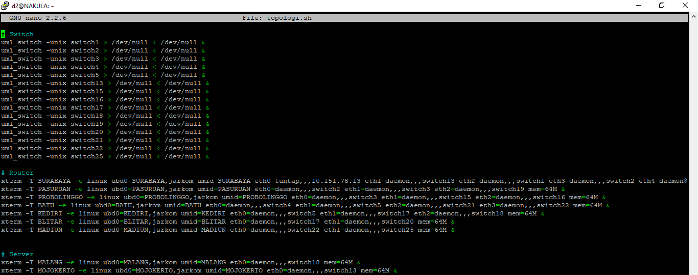
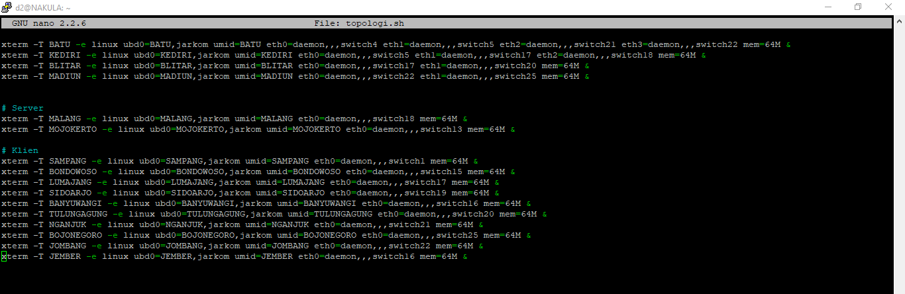
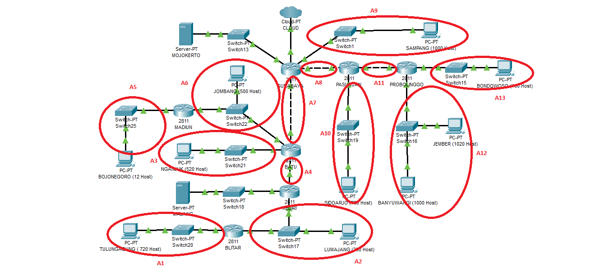
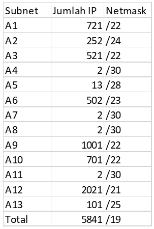
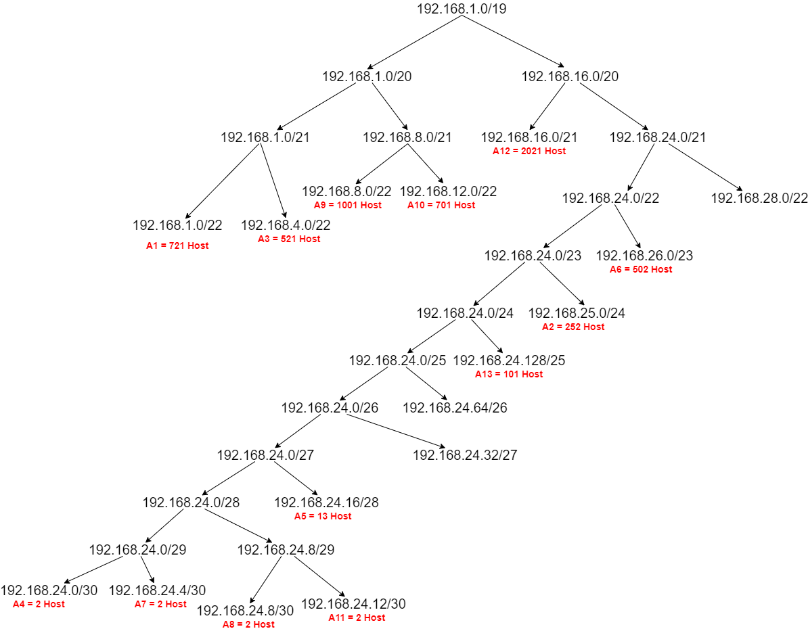
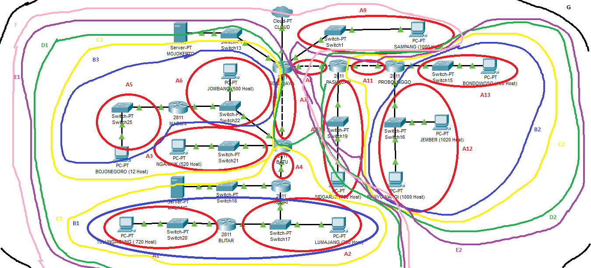
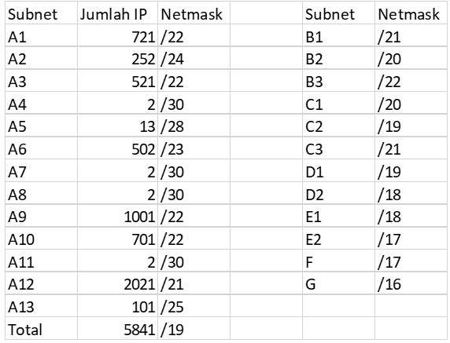
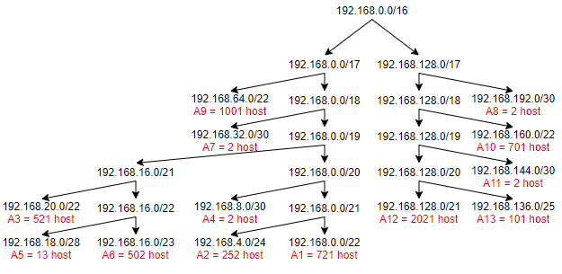

# Jarkom_Modul4_Lapres_D02

## Laporan Resmi Praktikum Modul 4 Jaringan Komputer 2020
**Kelompok D02**

-Calvin Wijaya 05111840000086

-Alie Husaini R. 05111840000097

### UML



### VLSM
#### VLSM Route

#### VLSM Table

#### VLSM Tree


### CIDR
#### CIDR Route


#### CIDR Table


#### CIDR Tree


#### CIDR Routing
```
Surabaya
Network D1 Gateway Batu
Network D2 Gateway Pasuruan
Network Malang Gateway Batu
Batu
Network B1 Gateway Kediri
Network A5 Gateway Madiun
Network Malang Gateway Kediri
Network Default Gateway Surabaya
Kediri
Network A1 Gateway Blitar
Network Default Gateway Batu
Blitar
Network Default Gateway Kediri
Madiun
Network Default Gateway Batu
Pasuruan
Network B2 Gateway Probolinggo
Network Default Gateway Surabaya
Probolinggo
Network Default Gateway Pasuruan
```
